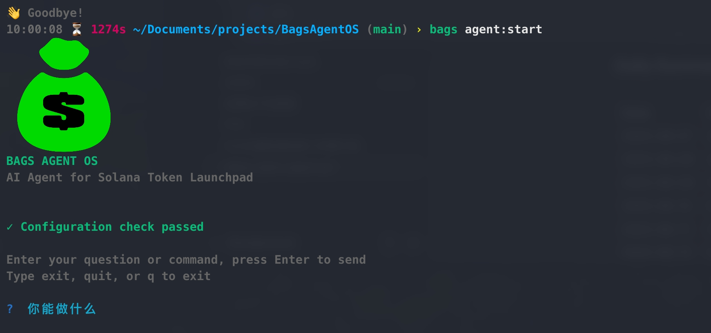

# Bags CLI



**Bags CLI** (previously BagsAgentOS) is an open-source command-line interface (CLI) + interactive AI Agent built specifically for the **Bags** platform — Solana's leading creator-first token launchpad.

### What is Bags?

[Bags.fm](https://bags.fm/) is a zero-code Solana launchpad that empowers creators to launch tokens (especially meme coins and community projects) while earning **1% royalty** on every trade forever. Platform highlights:

- **$31M+** in creator earnings
- **$5B+** in cumulative trading volume
- **250K+** projects launched
- Strong focus on long-term creator revenue (unlike many competitors)

Bags CLI brings terminal + AI automation to this ecosystem: launch faster, manage programmatically, and interact conversationally — no browser required.

### Interactive AI Agent

Run `bags agent:start` to enter conversational mode:

```
BAGS AGENT OS
AI Agent for Solana Token Launchpad
✓ Configuration check passed
> Enter your question or command...
```

Examples (supports English & Chinese):

```
> Launch a dog meme coin called $PupBag with 8.8 billion supply
> 帮我发一个猫咪主题的代币，名字 $NekoBag，总量10亿，描述：可爱猫咪吃包子
> Check my royalty balance and claim fees
```

### Key Features

- **Conversational AI** — natural language for launch, trade, claim royalties, query stats
- **Auto config validation** — wallet, RPC, Bags API key checks on startup
- **Bags API integration** — based on official docs at https://docs.bags.fm/
- **Developer-friendly** — scriptable commands, local-first, extensible
- **Roadmap**:
  - Multi-wallet support
  - Auto-sniping & new token monitoring
  - Batch launches
  - Social media auto-promotion helpers

### Quick Start

```bash
# 1. Clone the repo
git clone https://github.com/Sylvan-Lex/BagsAgentOS.git
cd BagsAgentOS

# 2. Install dependencies (Node.js + npm required)
npm install

# 3. Link globally
npm link

# 4. Configure your LLM and Bags API Key
bags config:set --base-url <your-llm-base-url> --model <model-name> --api-key <your-llm-key>
bags config:set-bags --api-key <your-bags-api-key>

# 5. Start the AI Agent
bags agent
```

### Commands

```bash
# Configuration
bags config:set --base-url <url> --model <model> --api-key <key>
bags config:set-bags --api-key <key>
bags config:show
bags config:init
bags config:lang --language <en|zh>

# Agent
bags agent        # Start interactive AI Agent mode
```

### Related Links

- Bags Platform: https://bags.fm/
- Official API Docs: https://docs.bags.fm/
- Developer Portal (API keys): https://dev.bags.fm/
- GitHub Repository: https://github.com/Sylvan-Lex/BagsAgentOS

---

Project is in very early stage. Welcome stars, forks, issues, PRs! Let's build the most powerful Solana launch tool together.